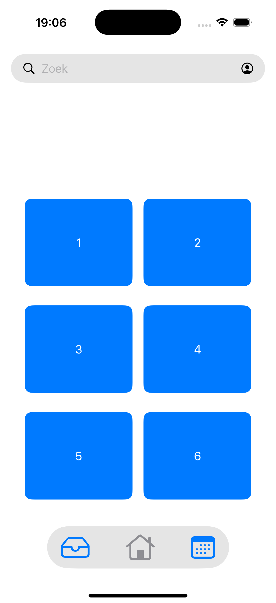
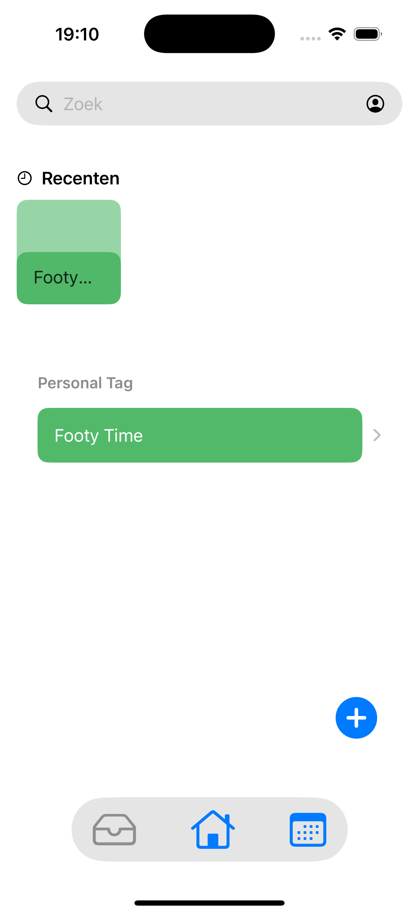
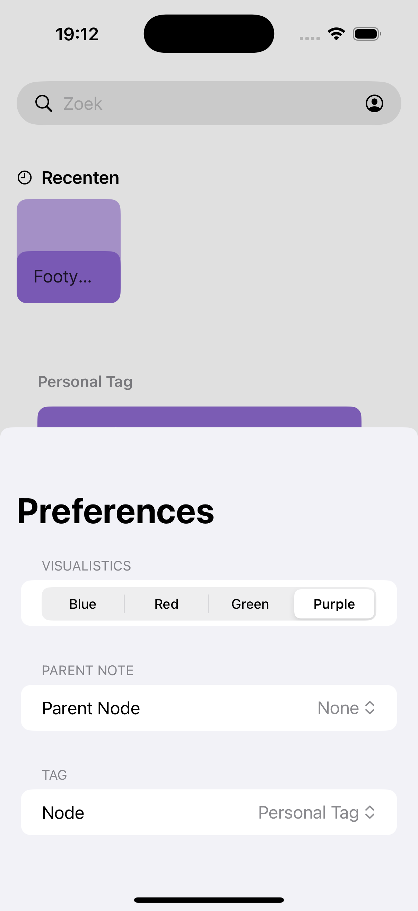
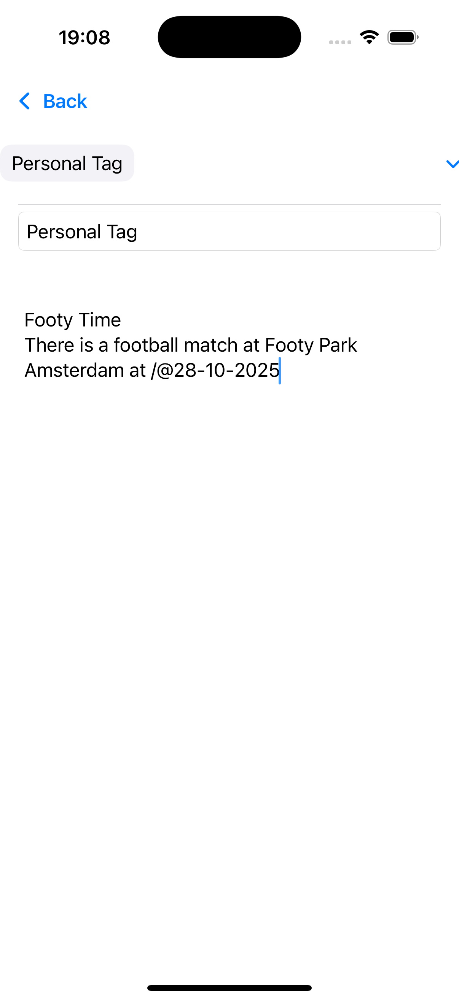
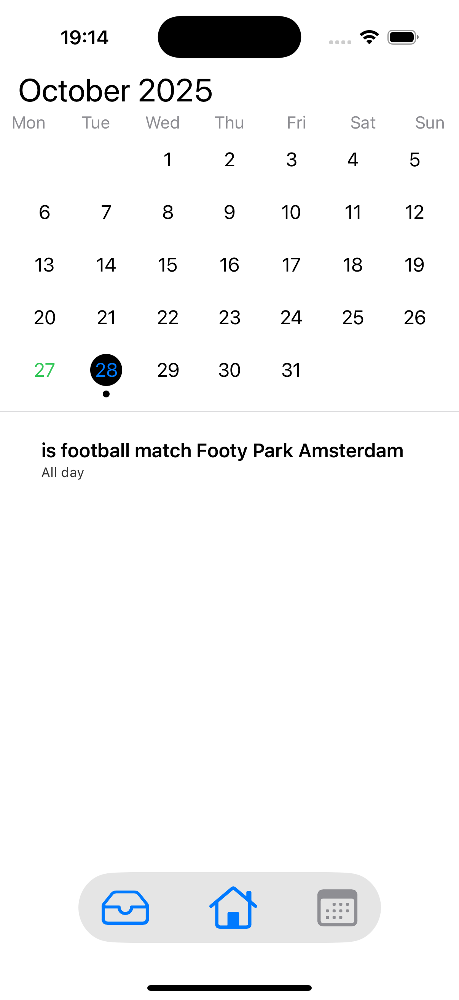

#  More than Tasks

**morethantasks** is a SwiftUI based productivity app that unifies your daily applications, combining: notes, calendar, events, and soon, smarter tools such as calorie tracker and personal insights.
morethantasks acts like a personalised dashboard for better organization.

---

## Features

-  **Notes**: Write, organize and categorise your ideas & tasks with tags
-  **Calendar View**: View and plan ahead with upcoming events and reminders
-  **Reminders**: Stay on top of deadlines and daily routines.
-  **Tag System** — Easily filter and find your notes by tag.
  
## Tasks 
  - [ ] Calorie Tracker  
  - [ ] Habit Tracker  
  - [ ] Cross-device Sync  
  - [ ] AI-powered note summaries
  - [ ] Collaborative editing
  - [ ] Account info page
  - [ ] Nested Notes
  - [ ] 

---

## Screenshots

  
  
  
  
  
  

---

## Tech Stack

- **SwiftUI** – for the elegant, reactive UI  
- **Core Data / SQLite / Postgres (if connected)** – for data persistence  
- **Combine** – for state and data flow management  
- **MVVM Architecture** – for clean and modular design

---

## Getting Started

### Prerequisites
- macOS 14+
- Xcode 16+
- iOS 17+ Simulator or Device

### Installation Process
1. Clone the repository
2. Setup Postgres database (for now) [MACOS Docker Guide](https://www.docker.com/blog/how-to-use-the-postgres-docker-official-image/)
3. Clone main.py, this will act as a server
