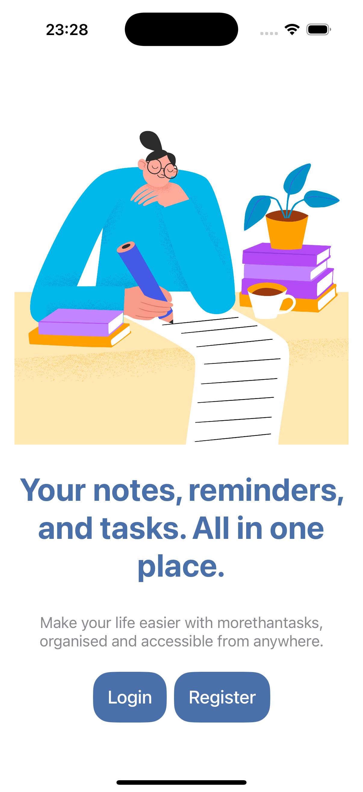
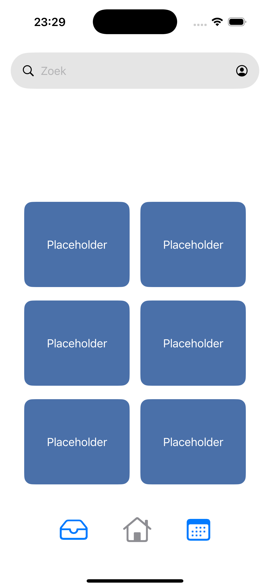
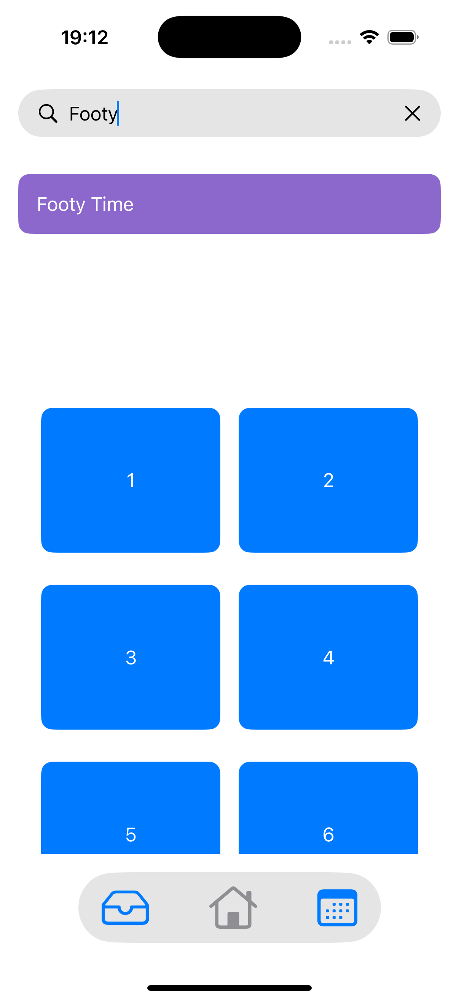
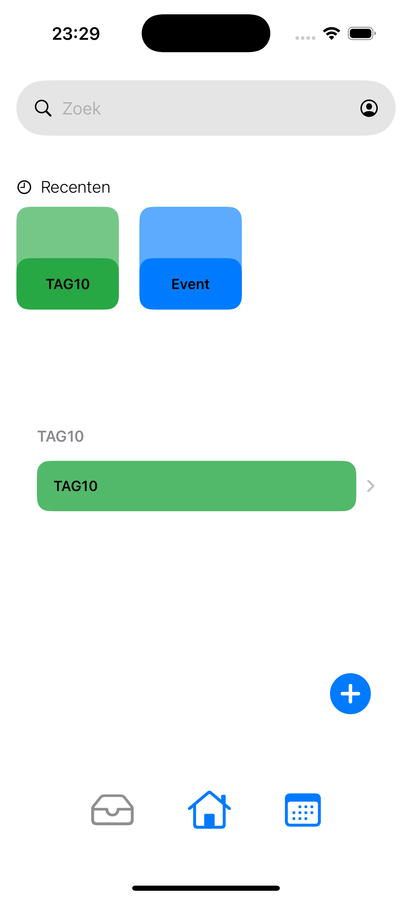
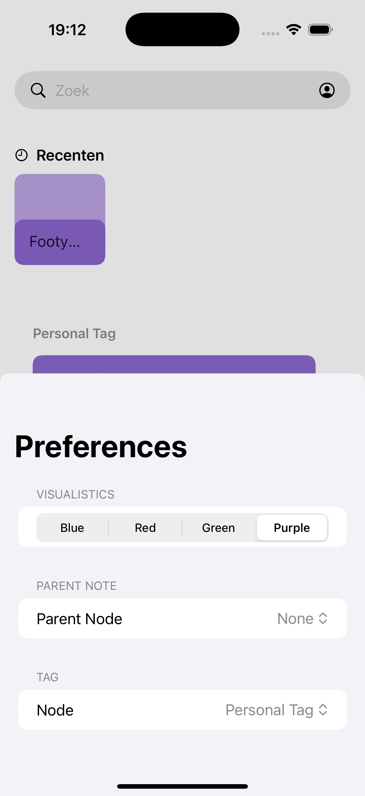
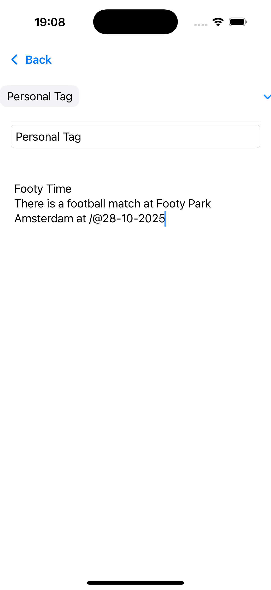
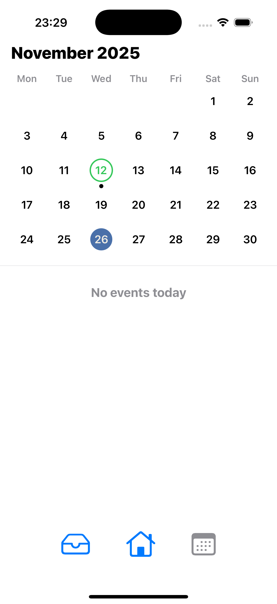

#  More than Tasks

**morethantasks** is a SwiftUI based productivity app that unifies your daily applications, combining: notes, calendar, events, and soon, smarter tools such as calorie tracker and personal insights.
morethantasks acts like a personalised dashboard for better organization.

---

## Features

-  **Notes**: Write, organize and categorise your ideas & tasks with tags
-  **Calendar View**: View and plan ahead with upcoming events and reminders
-  **Reminders**: Stay on top of deadlines and daily routines.
-  **Tag System** — Easily filter and find your notes by tag.
  
## Tasks 
  - [ ] Widget   
  - [x] Cross-device Sync (possible only with POSTGRESQL)
  - [ ] AI-powered note summaries
  - [ ] Collaborative editing
  - [ ] Account info page
  - [x] Login and Register
  - [ ] Make the UI prettier
  - [ ] Host the server online
  - [ ] Make a script that takes screenshots of all available features
  - [ ] Code-cleanup

---

## Screenshots

<p align="center">
   
   
  
   
  
  
   
</p>
---

## Tech Stack

- **SwiftUI** – for the elegant, reactive UI  
- **Core Data / SQLite / Postgres (if connected)** – for data persistence  
- **Combine** – for state and data flow management  
- **MVVM Architecture** – for clean and modular design

---

## Getting Started

### Prerequisites
- macOS 14+
- Xcode 16+
- iOS 17+ Simulator or Device
- Python 3.10+
- PostgreSQL 16 (local or Docker)

### Installation Process
1. Clone the repository.
2. Start a Postgres database with a `notes` database, user, and password — these
   are the defaults the server expects (see `notes-api/db.py`; override the host
   with `NOTES_DB_HOST`). [macOS Docker guide](https://www.docker.com/blog/how-to-use-the-postgres-docker-official-image/)
   ```bash
   docker run --name notes-db -e POSTGRES_DB=notes -e POSTGRES_USER=notes \
     -e POSTGRES_PASSWORD=notes -p 5432:5432 -d postgres:16
   ```
3. Install the server dependencies:
   ```bash
   cd notes-api
   python3 -m venv .venv && source .venv/bin/activate
   pip install -r requirements.txt
   ```
4. Run the server. Database migrations in `notes-api/migrations/` are applied
   automatically on startup, so a fresh database is fully set up on first boot:
   ```bash
   uvicorn main:app --reload --host 0.0.0.0 --port 8000
   ```
5. Open `morethantasks/morethantasks.xcodeproj` in Xcode and run the app on a
   simulator or device.

### Database migrations
Schema changes live as numbered SQL files in `notes-api/migrations/`. To add one,
drop a new `00N_description.sql` file in that folder — it is applied once on the
next server start and recorded in the `schema_migrations` table. You can also run
them manually with `python migrate.py`.
